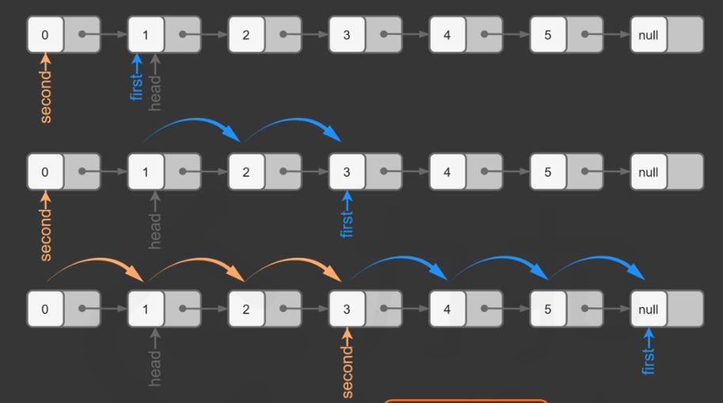

## 搜索算法（BFS，DFS）

### 邻居

搜索算法中经常会出现相邻节点，上下左右

```c++
vector<int> direction = {-1, 0, 1, 0, -1};

vector<vector<int>>& grid = {{...}}
int m = grid.size();
int n = grid[0].size();

// (i, j)'s neighbors NESW
for (int k = 0; k < 4; k++) {
    neigh_i = i + direction[k];
    neigh_j = j + direction[k+1];
    // valid neighbor
    if (neigh_x >= 0 && neigh_x < m && neigh_y >= 0 && neigh_y < n) {
        ...
    }
}
```

### 数据结构 （栈，队列）

节点坐标

`pair<int,int> p (i,j)`

`p = make_pair(i, j)`

`p.first, p.second`


### DFS

Stack 用来储存节点的坐标

`s.top(), s.pop(), s.push()`

```c++
stack<pair<int,int>> s;

s.push({i, j});
while (!s.empty()) {
    auto coordinate = s.top();
	s.pop();
    
    // neighbors of (i,j)
    for (neighs : (i,j)) {
        if (visited[neighs] == false) {
            visited[neighs] = true;
            dfs(neighs);
        }
        // or use stack
        if (visited[neighs] == false) {
            visited[neighs] = true;
            s.push(neighs);
        }
    }
}

```


### BFS

Queue 用来储存节点的坐标

`q.front(), q.pop(), q.push()`

```c++
queue<pair<int,int>> q;

q.push({i,j});
while (!q.empty()) {
    auto coordinate = q.front();
    q.pop();
    
    // neighbors of (i,j)
    for (neighs : (i,j)) {
        if (visited[neighs] == false) {
            visited[neighs] = true;
            s.push(neighs);
        }
    }
}
```


### 访问矩阵

记录访问过的节点，以防止循环访问

### 单源搜索

从单个节点向外搜索

#### [695. 岛屿的最大面积](https://leetcode.cn/problems/max-area-of-island/)

把每个岛屿的面积都求出来，再选取最大的岛屿

```c++
int maxAreaOfIsland(vector<vector<int>>& grid) {
	int m = grid
}
```


### 多源搜索

从多个节点同时向外扩张

#### [934. 最短的桥](https://leetcode.cn/problems/shortest-bridge/)

#### [542. 01 矩阵](https://leetcode.cn/problems/01-matrix/)


## 链表

#### 数据结构

```c++
// Definition for singly-linked list
struct ListNode {
     int val;
     ListNode *next;
     ListNode() : val(0), next(nullptr) {}
     ListNode(int x) : val(x), next(nullptr) {}
     ListNode(int x, ListNode *next) : val(x), next(next) {}
};
```

递归或者迭代

经常使用哑结点 (**记得最后要删除**)

```c++
ListNode* dummyHead = new ListNode();
dummyHead->next = head;
```

记得删除不需要的结点（释放内存）

删除节点的时候如果能取得删除节点的前一个节点会更加方便

```c++
// prev -> node (need to delete) -> next
ListNode* node = prev->next;
prev->next = node->next;
delete node;
```

移动链表指针一定步数

```c++
// dummyHead -> node1 -> node2 ->node3 -> null
//      fast 

ListNode* fast = dummyHead;
// move fast n+1 steps
for (int i = 1; i <= n + 1; i++) {
    fast = fast->next;
}

// n = 2, i <= 3, fast move n+1=3 steps
// i = 1, fast = node1
// i = 2, fast = node2
// i = 3, fast = node3
```


#### [203. 移除链表元素](https://leetcode.cn/problems/remove-linked-list-elements/)

```c++
ListNode* removeElements(ListNode* head, int val) {
    if (head == nullptr) {
        return head;
    }

    ListNode* dummyHead = new ListNode();
    dummyHead->next = head;

    ListNode* prev = dummyHead;

    while (prev->next != nullptr) {
        if (prev->next->val == val) {
            ListNode* del = prev->next; // node need to delete
            prev->next = del->next;
            delete del;
        }
        else {
            prev = prev->next;  // move to next node
        }
    }

    // remember to delete dummy head as well
    head = dummyHead->next;
    delete dummyHead;

    return head;
}
```


```c++
class MyLinkedList {
public:
    // singly linked list
    struct LinkedNode {
        int val;
        LinkedNode* next;
        LinkedNode(): val(0), next(nullptr) {}
        LinkedNode(int v): val(v), next(nullptr) {}
    };

    MyLinkedList() {
        dummyHead = new LinkedNode();
        size = 0;
    }
    
    int get(int index) {
        if (index < 0 || index > (size - 1) ) return -1;
    
        LinkedNode* curr = dummyHead;
        for (int i = 0; i <= index; i++) {
            curr = curr->next;
        }

        return curr->val;
    }
    
    // 在链表最前面插入一个节点，插入完成后，新插入的节点为链表的新的头结点
    void addAtHead(int val) {
        LinkedNode* newNode = new LinkedNode();
        newNode->val = val;

        newNode->next = dummyHead->next;
        dummyHead->next = newNode;

        size++;
    }
    
    // 在链表最后面添加一个节点
    void addAtTail(int val) {
        LinkedNode* curr = dummyHead;
        while (curr->next != nullptr) {
            curr = curr->next;
        }

        LinkedNode* newNode = new LinkedNode(val);
        newNode->next = curr->next;
        curr->next = newNode;
        size++;
    }
    
    //在链表中的第 index 个节点之前添加值为 val  的节点。如果 index 等于链表的长度，则该节点将附加到链表的末尾。如果 index 大于链表长度，则不会插入节点。如果index小于0，则在头部插入节点。
    void addAtIndex(int index, int val) {
        if (index > size) {
            return;
        }
        LinkedNode* newNode = new LinkedNode(val);
        // find where to insert
        LinkedNode* cur = dummyHead;
        while(index > 0) {
            cur = cur->next;
            index--;
        }
        newNode->next = cur->next;
        cur->next = newNode;
        size++;
    }
    
    //如果索引 index 有效，则删除链表中的第 index 个节点。
    void deleteAtIndex(int index) {
        if (index < 0 || index > (size - 1)) return;
        // find's delete node's prev node
        LinkedNode* prev = dummyHead;
        while (index > 0) {
            prev = prev->next;
            index--;
        }
        LinkedNode* temp = prev->next;
        prev->next = prev->next->next;
        delete temp;
        size--;
    }

    // need private members
private:
    LinkedNode* dummyHead;
    int size;
};

/**
 * Your MyLinkedList object will be instantiated and called as such:
 * MyLinkedList* obj = new MyLinkedList();
 * int param_1 = obj->get(index);
 * obj->addAtHead(val);
 * obj->addAtTail(val);
 * obj->addAtIndex(index,val);
 * obj->deleteAtIndex(index);
 */
```


#### [206. 反转链表](https://leetcode.cn/problems/reverse-linked-list/)

$1 \to 2 \to 3 \to \phi$

$3 \to 2 \to 1 \to \phi$

递归


注意如何获取$n_{k+1} = n_k.next$ 的，不需要通过遍历 $reverseList(n_{k+1})$ 

```c++
ListNode* reverseList(ListNode* head) {
    // list with 0 or 1 element
    if (head == nullptr || head->next == nullptr) {
        return head;
    }
    
    ListNode* newHead = reverseList(head->next);
    head->next->next = head;
    head->next = nullptr;
    
    return newHead;
}
```

遍历


注意，这里的prev并不是哑结点，而只是用来储存curr的前一个节点而已

```c++
ListNode* reverseList(ListNode* head) {
    // at the beginning, curr's previous node is nullptr
    ListNode* prev = nullptr;
    ListNode* curr = head;
    
    while (curr != nullptr) {
        ListNode* next = curr->next;
        curr->next = prev;
        // move to next position 
        prev = curr;
        curr = next;
    }
    
    return prev;
}
```

#### [24. 两两交换链表中的节点](https://leetcode.cn/problems/swap-nodes-in-pairs/)

递归

```c++
ListNode* swapPairs(ListNode* head) {
    if (head == nullptr || head->next == nullptr) {
        return head;
    }
    
    ListNode* newHead = swapPairs(head->next->next);
    ListNode* next = head->next;
    // change head->next->newHead to next->head->newHead
    next->next = head;
    head->next = newHead;
    
    return next;
}
```

迭代

**交换`temp`后的两个节点**


```c++
ListNode* swapPairs(ListNode* head) {
    ListNode* prevHead = new ListNode();
    prevHead->next = head;
    
    ListNode* temp = prevHead;
    while(temp->next != nullptr && temp->next->next != nullptr) {
        ListNode* node1 = temp->next;
        ListNode* node2 = temp->next->next;
        // change temp->node1->node2->next to temp->node2->node1->next
        temp->next = node2;
        node1->next = node2->next;
        node2->next = node1;
        
        temp = node1;
    }
	
    return prevHead->next;
}
```

#### [83. 删除排序链表中的重复元素](https://leetcode.cn/problems/remove-duplicates-from-sorted-list/)

Traversal 

```c++
ListNode* deleteDuplicates(ListNode* head) {
    if (head == nullptr || head->next == nullptr) {
        return head;
    }
    
    ListNode* curr = head;
    while(curr->next != nullptr) {
        // curr->next->nextnext
        if (curr->val == curr->next->val) {
            ListNode* temp = curr->next;	// store for deletion
            curr->next = curr->next->next;
            delete temp;
        }
        else {
            curr = curr->next;
        }
    }
    
    return head;
}
```


#### [328. 奇偶链表](https://leetcode.cn/problems/odd-even-linked-list/)

原始链表的头节点 head 也是奇数链表的头节点以及结果链表的头节点，head 的后一个节点是偶数链表的头节点。令 evenHead = head.next，则 evenHead 是偶数链表的头节点。


```c++
ListNode* oddEvenList(ListNode* head) {
    if (head == nullptr) {
        return head;
    }
    
    ListNode* oddHead = head;
    ListNode* evenHead = head->next;
    
    ListNode* odd = oddHead;
    ListNode* even = evenHead;
    
    while(even != nullptr && even->next != nullptr) {
        odd->next = even->next;
        odd = odd->next;
        even->next = odd->next;	// odd is updated
        even = even->next;
    }
    
    // now odd is the last element of odd list
    odd->next = evenHead;
    
    return oddHead;
}
```

#### [19. 删除链表的倒数第 N 个结点](https://leetcode.cn/problems/remove-nth-node-from-end-of-list/)

为了方便操作，应该取得被删节点之前的节点

For example, $1 \to 2 \to 3 \to 4 \to \phi$ 

say we need to delete 3, we need to know `prev_delete = 2`

```c++
ListNode* temp = prev_delete->next;	// store node need to delete
prev_delete->next = prev_delete->next->next;
delete temp;
```

**Method1**

1. get size of linked list
2. locate last Nth node's previous node


**Method2**

Use fast and slow pointer to locate last Nth node's previous node

由于我们需要找到倒数第 n 个节点，因此我们可以使用两个指针 first, second 同时对链表进行遍历，并且 first 比 second 超前 n 个节点。当 first 遍历到链表的末尾时，second 就恰好处于倒数第 n 个节点。为了使second在倒数第 n 个节点之前，我们可以让second从哑结点开始。



```c++
ListNode* removeNthFromEnd(ListNode* head, int n) {
    ListNode* dummyHead = new ListNode();
    dummyHead->next = head;
    ListNode* slow = dummyHead;
    ListNode* fast = dummyHead;

    // move fast n+1 steps
    for (int i = 1; i <= n + 1; i++) {
        fast = fast->next;
    }

    while (fast != nullptr) {
        slow = slow->next;
        fast = fast->next;
    }

    ListNode* del = slow->next;
    slow->next = del->next;
    delete del;

    return dummyHead->next;
}
```


#### [160. 相交链表](https://leetcode.cn/problems/intersection-of-two-linked-lists/)


```c++

```


```c++
	
```


#### [142. 环形链表 II](https://leetcode.cn/problems/linked-list-cycle-ii/)

##### Hash Table

```c++
unordered_set<ListNode*> container;
// find 
container.find(curr) == container.end();

// count
container.count(curr) 
```

给定一个链表，有环把环的入口找出来，无环返回nullptr。

**Method1**

Traverse the linked list and store the address of node, if we meet node that is already stored, then this is the enter of cycle. Since the address is unique, we can use set to store.

```c++
ListNode* detectCycle(ListNode* head) {
	unordered_set<ListNode*> address;
    
    ListNode* curr = head;
    
    while (curr != nullptr) {
        // check if curr exists
        if (address.find(curr) != address.end()) {
            return curr;
        }
        // store curr
        address.insert(curr);
        curr = curr->next;
    }
    
    return nullptr;
}
```

**Method2**

Fast and slow pointer start at the head of linked list.

Fast pointer moves 2 steps and slow pointer moves 1 step each time. If there is cycle in linked list, fast and slow pointer will meet in cycle.

当发现 slow 与 fast 相遇时，我们再额外使用一个指针 ptr。起始，它指向链表头部；随后，它和 slow 每次向后移动一个位置。最终，它们会在入环点相遇。


```c++
ListNode* detectCycle(ListNode* head) {
    ListNode* fast = head;
    ListNode* slow = head;
    
    while (fast != nullptr && fast->next != nullptr) {
        slow = slow->next;
        fast = fast->next->next;
        
        // there is a cycle
        if (fast == slow) {
            ListNode* ptr = head;
            while (ptr != slow) {
                ptr = ptr->next;
                slow = slow->next;             
            }
            return ptr; // or slow
        }
    }
    
    return nullptr;
}
```


#### [147. 对链表进行插入排序](https://leetcode.cn/problems/insertion-sort-list/)


#### [148. 排序链表](https://leetcode.cn/problems/sort-list/)

**Method1** 


```c++
ListNode* sortList(ListNode* head) {
    ListNode* fast = head;
    ListNode* slow = head;
    
    while (fast != nullptr && fast->next != nullptr) {
        
    }
}
```


## 哈希

#### [242. 有效的字母异位词](https://leetcode.cn/problems/valid-anagram/)

Notice how to deal with index of each character

```c++
bool isAnagram(string s, string t) {
    vector<int> record (26, 0);

    // record char appears in string s
    for (char c : s) {
        record[c - 'a'] += 1;
    }

    for (char c : t) {
        record[c - 'a'] -= 1;
    }

    for (auto num: record) {
        if (num != 0) return false;
    }

    return true;
}
```

#### [349. 两个数组的交集](https://leetcode.cn/problems/intersection-of-two-arrays/)


Notice conversion between vector and unordered_set (two containers)

```c++
vector<int> intersection(vector<int>& nums1, vector<int>& nums2) {
    unordered_set<int> store_nums1 (nums1.begin(), nums1.end());

    unordered_set<int> res;
    for (int num : nums2) {
        // if num is already in nums1, add to common res
        if (store_nums1.find(num) != store_nums1.end()) {
            res.insert(num);
        }
    }

    return vector<int> (res.begin(), res.end());
}
```

#### [202. 快乐数](https://leetcode.cn/problems/happy-number/)

题目中说了会 **无限循环**，那么也就是说**求和的过程中，sum会重复出现，这对解题很重要！**

所以这道题目使用哈希法，来判断这个sum是否重复出现，如果重复了就是return false， 否则一直找到sum为1为止。

判断sum是否重复出现就可以使用unordered_set。

**还有一个难点就是求和的过程，如果对取数值各个位上的单数操作不熟悉的话，做这道题也会比较艰难。**

```c++
class Solution {
public:
    // n = 19, getSum(19) = 1^2 + 9^2 = 82
    int getSum(int n) {
        int sum = 0;
        // 从低位到高位依次取
        while (n > 0) {
            int digit = n % 10;
            sum += digit * digit;
            n /= 10;
        }
        return sum;
    }
    
    bool isHappy(int n) {
		unordered_set<int> us;
        while (true) {
            int sum = getSum(n);
            if (sum == 1) {
                return true;
            }
            // 如果这个sum曾经出现过，说明已经陷入了无限循环了，立刻return false
            if (us.find(sum) != us.end()) {
                return false;
            } 
            else {
                us.insert(sum);
            }
            n = sum;      
        }
    }
};
```

#### [1. 两数之和](https://leetcode.cn/problems/two-sum/)

```c++
class Solution {
public:
    vector<int> twoSum(vector<int>& nums, int target) {
        std::unordered_map <int,int> map;	// {nums, index}
        for(int i = 0; i < nums.size(); i++) {
            auto iter = map.find(target - nums[i]);
            if(iter != map.end()) {
                return {iter->second, i};
            }
            map.insert(pair<int, int>(nums[i], i));
            // or 
            // map[nums[i]] = i;
        }
        return {};
    }
};
```


## 字符串

#### [344. 反转字符串](https://leetcode.cn/problems/reverse-string/)

Notice how to swap two char

```c++
class Solution {
public:
    void reverseString(vector<char>& s) {
        int n = s.size();

        for (int i = 0, j = n - 1; i < n / 2; i++, j--) {
            // swap s[i], s[j]
            swap(s[i], s[j]);
            // char c = s[i];
            // s[i] = s[j];
            // s[j] = c;
        }
    }
};
```


## 双指针

#### [27. 移除元素](https://leetcode.cn/problems/remove-element/)

**Brute-Force:**

```c++
// 时间复杂度：O(n^2)
// 空间复杂度：O(1)
class Solution {
public:
    int removeElement(vector<int>& nums, int val) {
        int size = nums.size();
        for (int i = 0; i < size; i++) {
            if (nums[i] == val) { // 发现需要移除的元素，就将数组集体向前移动一位
                for (int j = i + 1; j < size; j++) {
                    nums[j - 1] = nums[j];
                }
                i--; // 因为下标i以后的数值都向前移动了一位，所以i也向前移动一位
                size--; // 此时数组的大小-1
            }
        }
        return size;

    }
};
```

双指针法（快慢指针法）： **通过一个快指针和慢指针在一个for循环下完成两个for循环的工作。**

```c++
class Solution {
public:
    int removeElement(vector<int>& nums, int val) {
        int slowIndex = 0;
        for (int fastIndex = 0; fastIndex < nums.size(); fastIndex++) {
            if (val != nums[fastIndex]) {
                nums[slowIndex] = nums[fastIndex];
                slowIndex++;
            }
        }
        return slowIndex;
    }
};
```

#### [剑指 Offer 05. 替换空格](https://leetcode.cn/problems/ti-huan-kong-ge-lcof/)

首先扩充数组到每个空格替换成"%20"之后的大小。

然后从后向前替换空格，也就是双指针法，过程如下：

i指向新长度的末尾，j指向旧长度的末尾。


**其实很多数组填充类的问题，都可以先预先给数组扩容带填充后的大小，然后在从后向前进行操作。**

```c++
class Solution {
public:
    string replaceSpace(string s) {
        int sOldSize = s.size();
		// count space 
        int count = 0;
        for (char c : s) {
            if (c == ' ') {
                count++;
            }
        }
        
        // resize string
        s.resize(sOldSize + 2*count);
        int sNewSize = s.size();
        for (int i = sNewSize - 1, j = sOldSize - 1; j < i; i--, j--) {
            if (s[j] != ' ') {
                s[i] = s[j];
            } else {
                s[i] = '0';
                s[i - 1] = '2';
                s[i - 2] = '%';
                i -= 2;
            }
        }
        return s;
    }
};
```

#### [151. 颠倒字符串中的单词](https://leetcode.cn/problems/reverse-words-in-a-string/)


## 栈和队列

#### [232. 用栈实现队列](https://leetcode.cn/problems/implement-queue-using-stacks/)

两个栈，一个输入栈，一个输出栈

在push数据的时候，只要数据放进输入栈就好，**但在pop的时候，操作就复杂一些，输出栈如果为空，就把进栈数据全部导入进来（注意是全部导入）**，再从出栈弹出数据，如果输出栈不为空，则直接从出栈弹出数据就可以了。

最后如何判断队列为空呢？**如果进栈和出栈都为空的话，说明模拟的队列为空了。**

注意peek()可以通过pop()实现

```c++
int peek() {
    int res = this->pop(); // 直接使用已有的pop函数
    stOut.push(res); // 因为pop函数弹出了元素res，所以再添加回去
    return res;
}
```

#### [225. 用队列实现栈](https://leetcode.cn/problems/implement-stack-using-queues/)

**用两个队列que1和que2实现队列的功能，que2其实完全就是一个备份的作用**，把que1最后面的元素以外的元素都备份到que2，然后弹出最后面的元素，再把其他元素从que2导回que1。

```c++
queue.push(1);        
queue.push(2);        
queue.pop();   // 注意弹出的操作       
queue.push(3);        
queue.push(4);       
queue.pop();  // 注意弹出的操作    
queue.pop();    
queue.pop();    
queue.empty(); 
```

1.   queue.push(1)

queue1: [1]

queue2: []

stack: [1]

2.   queue.push(2)

queue1: [1, 2]

queue2: []

stack: [1, 2]

3.   queue.pop(), 把要弹出来的留在q1，其余的元素放入q2，弹出q1元素，把q2的元素加入q1，并清空q2

queue1: [1, 2] -> [2] -> [] -> [1]

queue2: [] -> [1] -> []

stack: [1, 2] -> [1]

```c++
class MyStack {
public:
    queue<int> que1;
    queue<int> que2; // 辅助队列，用来备份
    /** Initialize your data structure here. */
    MyStack() {

    }

    /** Push element x onto stack. */
    void push(int x) {
        que1.push(x);
    }

    /** Removes the element on top of the stack and returns that element. */
    int pop() {
        int size = que1.size();
        size--;
        while (size--) { // 将que1 导入que2，但要留下最后一个元素
            que2.push(que1.front());
            que1.pop();
        }

        int result = que1.front(); // 留下的最后一个元素就是要返回的值
        que1.pop();
        que1 = que2;            // 再将que2赋值给que1
        while (!que2.empty()) { // 清空que2
            que2.pop();
        }
        return result;
    }

    /** Get the top element. */
    int top() {
        return que1.back();
    }

    /** Returns whether the stack is empty. */
    bool empty() {
        return que1.empty();
    }
};
```

#### [20. 有效的括号](https://leetcode.cn/problems/valid-parentheses/)

在匹配左括号的时候，右括号先入栈，就只需要比较当前元素和栈顶相不相等就可以了，比左括号先入栈代码实现要简单的多了！

```c++
class Solution {
public:
    bool isValid(string s) {
        stack<int> st;
        for (int i = 0; i < s.size(); i++) {
            if (s[i] == '(') st.push(')');	// add ')'
            else if (s[i] == '{') st.push('}');
            else if (s[i] == '[') st.push(']');
            // 第三种情况：遍历字符串匹配的过程中，栈已经为空了，没有匹配的字符了，说明右括号没有找到对应的左括号 return false
            // 第二种情况：遍历字符串匹配的过程中，发现栈里没有我们要匹配的字符。所以return false
            else if (st.empty() || st.top() != s[i]) return false;
            else st.pop(); // st.top() 与 s[i]相等，栈弹出元素
        }
        // 第一种情况：此时我们已经遍历完了字符串，但是栈不为空，说明有相应的左括号没有右括号来匹配，所以return false，否则就return true
        return st.empty();
    }
};		
```

#### [1047. 删除字符串中的所有相邻重复项](https://leetcode.cn/problems/remove-all-adjacent-duplicates-in-string/)

把字符按顺序添加到栈里，如果添加的元素与栈顶元素相同，则说明是重复元素，把栈顶元素弹出。最后翻转一下字符串即可。

```c++
class Solution {
public:
    string removeDuplicates(string s) {
        stack<char> st;

        for (char c : s) {
            if (st.empty() || c != st.top()) {
                st.push(c);
            } 
            else {
                st.pop(); // s 与 st.top()相等的情况
            }
        }

        string res = "";
        while (!st.empty()) {
            res += st.top();
            st.pop();
        }

        // reverse string res
        // for (int i = 0, j = res.size()-1; i < res.size()/2; i++, j--) {
        //     swap(res[i], res[j]);
        // }

        reverse (res.begin(), res.end());

        return res;        
    }
};
```


#### [150. 逆波兰表达式求值](https://leetcode.cn/problems/evaluate-reverse-polish-notation/)

注意如何把string转换成int， stoi(s)

```c++
class Solution {
public:
    int evalRPN(vector<string>& tokens) {
        stack<int> st;
        for (int i = 0; i < tokens.size(); i++) {
            if (tokens[i] == "+" || tokens[i] == "-" || tokens[i] == "*" || tokens[i] == "/") {
                int num1 = st.top();
                st.pop();
                int num2 = st.top();
                st.pop();
                if (tokens[i] == "+") st.push(num2 + num1);
                if (tokens[i] == "-") st.push(num2 - num1);
                if (tokens[i] == "*") st.push(num2 * num1);
                if (tokens[i] == "/") st.push(num2 / num1);
            } else {
                st.push(stoi(tokens[i]));
            }
        }
        int result = st.top();
        st.pop(); // 把栈里最后一个元素弹出（其实不弹出也没事）
        return result;
    }
};
```


#### [239. 滑动窗口最大值](https://leetcode.cn/problems/sliding-window-maximum/)

遍历数组，将 数 存放在双向队列中，并用 L,R 来标记窗口的左边界和右边界。队列中保存的并不是真的 数，而是该数值对应的数组下标位置，并且数组中的数要从大到小排序。如果当前遍历的数比队尾的值大，则需要弹出队尾值，直到队列重新满足从大到小的要求。刚开始遍历时，L 和 R 都为 0，有一个形成窗口的过程，此过程没有最大值，L 不动，R 向右移。当窗口大小形成时，L 和 R 一起向右移，每次移动时，判断队首的值的数组下标是否在 [L,R] 中，如果不在则需要弹出队首的值，当前窗口的最大值即为队首的数。

由于队列中下标对应的元素是严格单调递减的，因此此时队首下标对应的元素就是滑动窗口中的最大值。

```
输入: nums = [1,3,-1,-3,5,3,6,7], 和 k = 3
输出: [3,3,5,5,6,7]

解释过程中队列中都是具体的值，方便理解，具体见代码。
初始状态：L=R=0,队列:{}
i=0,nums[0]=1。队列为空,直接加入。队列：{1}
i=1,nums[1]=3。队尾值为1，3>1，弹出队尾值，加入3。队列：{3}
i=2,nums[2]=-1。队尾值为3，-1<3，直接加入。队列：{3,-1}。此时窗口已经形成，L=0,R=2，result=[3]
i=3,nums[3]=-3。队尾值为-1，-3<-1，直接加入。队列：{3,-1,-3}。队首3对应的下标为1，L=1,R=3，有效。result=[3,3]
i=4,nums[4]=5。队尾值为-3，5>-3，依次弹出后加入。队列：{5}。此时L=2,R=4，有效。result=[3,3,5]
i=5,nums[5]=3。队尾值为5，3<5，直接加入。队列：{5,3}。此时L=3,R=5，有效。result=[3,3,5,5]
i=6,nums[6]=6。队尾值为3，6>3，依次弹出后加入。队列：{6}。此时L=4,R=6，有效。result=[3,3,5,5,6]
i=7,nums[7]=7。队尾值为6，7>6，弹出队尾值后加入。队列：{7}。此时L=5,R=7，有效。result=[3,3,5,5,6,7]

```

```c++
class Solution {
public:
    vector<int> maxSlidingWindow(vector<int>& nums, int k) {
        int n = nums.size();
        deque<int> q;
        for (int i = 0; i < k; ++i) {
            while (!q.empty() && nums[i] >= nums[q.back()]) {
                q.pop_back();
            }
            q.push_back(i);
        }

        vector<int> ans = {nums[q.front()]};
        for (int i = k; i < n; ++i) {
            while (!q.empty() && nums[i] >= nums[q.back()]) {
                q.pop_back();
            }
            q.push_back(i);
            while (q.front() <= i - k) {
                q.pop_front();
            }
            ans.push_back(nums[q.front()]);
        }
        return ans;
    }
};
```

#### [347. 前 K 个高频元素](https://leetcode.cn/problems/top-k-frequent-elements/)

##### 数据结构（优先级队列）

默认为大顶堆


添加自定义数据结构或者自定义比较方式

```c++
struct fruit
{
	string name;
	int price;
};
```

```c++
// method 1, overload '<'

// 希望水果价格高为优先级高, 大顶堆
struct fruit
{
	string name;
	int price;
	friend bool operator < (fruit f1,fruit f2)
	{
		return f1.price < f2.price;
	}
};

// 希望水果价格低为优先级高, 小顶堆
struct fruit
{
	string name;
	int price;
	friend bool operator < (fruit f1,fruit f2)
	{
		return f1.price > f2.price;
	}
};

```

```c++
// method 2, functional

// 希望水果价格高为优先级高, 大顶堆
struct myComparison
{
	bool operator () (fruit f1,fruit f2)
	{
		return f1.price < f2.price;
	}
};

//此时优先队列的定义应该如下
priority_queue<fruit,vector<fruit>,myComparison> q;

```

##### unordered_map

```
typedef pair<const Key, T> value_type;
```


##### Code


维护一个小顶堆，使堆中的元素个数为k


```c++
输入: nums = [1,1,1,2,2,3], k = 2
输出: [1,2]
```

```c++
class Solution {
public:
    vector<int> topKFrequent(vector<int>& nums, int k) {
		// <num, num frequency>
        unordered_map<int, int> occurrences;	// pair<int, int> = pair<key, value>
        for (const auto& v : nums) {
            occurrences[v]++;
        }
        
        // pair 的第一个元素代表数组的值，第二个元素代表了该值出现的次数
        // 根据出现的次数来进行优先排序(小顶堆)
        struct myComparison {
        	bool operator() (const pair<int, int>& lhs, const pair<int, int>& rhs) const {
                return lhs.second > rhs.second; //小顶堆是大于号 
            }  
        };
        
        priority_queue<pair<int, int>, vector<pair<int, int>>, myComparison> pq;
        
        for (const auto& elem : occurrences) {
            pq.push(elem);
            // 如果堆的大小大于了K，则队列弹出，保证堆的大小一直为k
            if (pq.size() > k) {
                pq.pop();
            }
        }
        
        vector<int> res;
        while (!pq.empty()) {
            auto top = pq.top();	// <num, num freq>
            res.push_back(top.first);
            pq.pop();
        }
        
        return res;          
    }
};
```


## 树

### 递归

#### [104. 二叉树的最大深度](https://leetcode.cn/problems/maximum-depth-of-binary-tree/)

depth(root) = 1 + max(depth(root.left) + depth(root.right))

```c++
int maxDepth(TreeNode* root) {
    if (root == nullptr) {
        return 0;
    }
    
    return 1 + max(maxDepth(root->left), maxDepth(root->right));
}
```

#### [110. 平衡二叉树](https://leetcode.cn/problems/balanced-binary-tree/)

**自顶向下**

```c++
int height(TreeNode* root) {
    if (!root) {
        return 0;
    }
    else {
        return 1 + max(height(root->left), height(root->right) );
    }
}

bool isBalanced(TreeNode* root) {
    if (!root) {
        return true;
    }        
    else {
        return abs(height(root->left) - height(root->right)) <= 1 && isBalanced(root->left) && isBalanced(root->right);
    }
}
```

**自底向上**


后续遍历：左右根

```c++
int height(TreeNode* root) {
    if (root == nullptr) {
        return 0;
    }
    
    int leftHeight = height(root->left);
    int rightHeight = height(root->right);
    if (leftHeight == -1 || rightHeight == -1 || abs(leftHeight - rightHeight) > 1) {
        return -1;
    }
    else {
        return 1 + max(leftHeight, rightHeight);
    }
}

bool isBalanced(TreeNode* root) {
	return height(root) >= 0;
}
```

#### [543. 二叉树的直径](https://leetcode.cn/problems/diameter-of-binary-tree/)

一棵二叉树的直径长度是任意两个结点路径长度中的最大值。这条路径可能穿过也可能不穿过根结点。

节点最大直径 = 左子树深度+右子树深度


```c++
int diameter = -1;	// initial diameter as min

int diameterOfBinaryTree(TreeNode* root) {
    depth(root);
    
    return diameter;
}

int depth(TreeNode* root) {
    if (root == nullptr) {
        return 0;
    }
    
    int leftDepth = depth(root->left);
    int rightDepth = depth(root->right);
    
    diameter = max(diameter, leftDepth + rightDepth);	// update max diameter
    
    return 1 + max(leftDepth, rightDepth);	// return depth
}
```

#### [437. 路径总和 III](https://leetcode.cn/problems/path-sum-iii/)


对于每个节点p：rootSum(p, val)

而对于所有的节点：rootSum(root, targetSum) + pathSum(root->left, targetSum) + pathSum(root->right, targetSum)

rootSum(root, targetSum): 对于root有多少种路径？递归左右子树得到

pathSum(root->left, targetSum)：递归左子树，对于左子树都多少种路径？遍历所有节点

总共有两次遍历

```c++
int rootSum(TreeNode* root, int targetSum) {
    if (root == nullptr) {
        return 0;
    }
    
    int res = 0;
    
    if (root->val == targetSum) res++;
    
    res += rootSum(root->left, targetSum - root->val);
    res += rootSum(root->right, targetSum - root->val);
    
    return res; 
}

int pathSum(TreeNode* root, int targetSum) {
    if (root == nullptr) {
        return 0;
    }
    
    int res = rootSum(root, targetSum);
    res += pathSum(root->left, targetSum);
    res += pathSum(root->right, targetSum);
    
    return res;
}
```

#### [101. 对称二叉树](https://leetcode.cn/problems/symmetric-tree/)

两个子树是否**对称**或者**相等**：


DFS：

```c++
// check if two tree are mirror
bool check(TreeNode* t1, TreeNode* t2) {
    // both null tree
    if (!t1 && !t2) {
        return true;
    }

    // one tree is empty
    if (!t1 || !t2) {
        return false;
    }

    return (t1->val == t2->val) && check(t1->left, t2->right) && 
            check(t1->right, t2->left);
}


bool isSymmetric(TreeNode* root) {
    return check(root, root);
}
```

BFS：

```c++
bool isSymmetric(TreeNode* root) {
    std::queue<TreeNode*> q;
    q.push(root);
    q.push(root);

    while (!q.empty()) {
        TreeNode* t1 = q.front();
        q.pop();
        TreeNode* t2 = q.front();
        q.pop();

        if (!t1 && !t2) continue;    // both empty tree
        if ((!t1 || !t2) || (t1->val != t2->val)) return false;   

        // mirror pair
        q.push(t1->left);
        q.push(t2->right);

        q.push(t1->right);
        q.push(t2->left);

    }

    return true;
}
```

### 层次遍历


#### [637. 二叉树的层平均值](https://leetcode.cn/problems/average-of-levels-in-binary-tree/)

```c++
vector<double> averageOfLevels(TreeNode* root) {
    vector<double> res;
    
    if (root == nullptr) {
        return res;
    }

    queue<TreeNode*> q;
    q.push(root);

    while (!q.empty()) {
        int level_size = q.size();  // current level size
        double sum = 0.0;

        // pop up all current level's nodes and add next level's nodes
        for (int i = 0; i < level_size; i++) {
            TreeNode* node = q.front();
            q.pop();
            sum += node->val;

            if (node->left) q.push(node->left);
            if (node->right) q.push(node->right);
        }

        res.push_back(sum/level_size);

    }

    return res;
}
```

### 前中后序遍历

前：根左右

中：左根右

后：左右根

```c++
void preorder(TreeNode* root) {
    visit(root);
    preorder(root->left);
    preorder(root->right);
}

void inorder(TreeNode* root) {
    inorder(root->left);
    visit(root);
    inorder(root->right);
}

void postorder(TreeNode* root) {
    postorder(root->left);
    postorder(root->right);
    visit(root);
}
```

#### [105. 从前序与中序遍历序列构造二叉树](https://leetcode.cn/problems/construct-binary-tree-from-preorder-and-inorder-traversal/)


```c++
unordered_map<int, int> index;  // {TreeNode->val, TreeNode->index}

// build tree recursively based on preorder (not inorder!!!)
TreeNode* buildTreeHelper(const vector<int>& preorder,const vector<int>& inorder, int preorder_left, int preorder_right, int inorder_left, int inorder_right ){
    if (preorder_left > preorder_right) {
        return nullptr;
    }    

    // find root index in preorder
    int preorder_root = preorder_left;

    // find root index in inorder
    int inorder_root = index[preorder[preorder_root]];

    // build root
    TreeNode* root = new TreeNode(preorder[preorder_root]);

    // size of left subtree
    int size_left_subtree = inorder_root - inorder_left;

    // build left subtree
    root->left = buildTreeHelper(preorder, inorder, preorder_left + 1, preorder_left + size_left_subtree, inorder_left, inorder_root-1);

    // build right subtree
    root->right = buildTreeHelper(preorder, inorder, preorder_left + size_left_subtree + 1, preorder_right, inorder_root + 1, inorder_right);

    return root;
}


TreeNode* buildTree(vector<int>& preorder, vector<int>& inorder) {
    int n = preorder.size();
    // build hash map
    for (int i = 0; i < n; i++){
        index[inorder[i]] = i;
    }

    return buildTreeHelper(preorder, inorder, 0, n-1, 0, n-1);
}
```


## 图


### Dijkstra

Node has three states: 

1. Open set: implemented in priority queue = <g(n), node n>, (visited but unexpanded, meaning that sucessors have not been explored yet). This is the list of pending tasks.
2. Close set: visited and expanded, the node in close set has optimal cost. 
3. Not in open set and close set: unvisited node (newly explored node).

g(n) = accumulated cost from start state to node "n"

Strategy: **expand node with least g(n)**

```c++
struct Node {
    state;	// open list, close list, unvisited
    parent;
    g;	// distance to source
}
```

```c++
void Dijkstra(...) {
    typedef pair<int, int> pi;	// <g(n), node index>
    priority_queue<pi, vector<pi>, greater<pi>> OpenSet;
    
    // initialize
    dist[source] = 0;	// source.g = 0;
    dist[other_nodes] = inf;	// initial other nodes g as inf, g[n] = inf
    vector<bool> CloseSet (Graph.size()); // store expanded node
    
    while (true) {
        // no nodes to expand, return 
        if (OpenSet.empty()) {
            return;
        }
        // expand node with lowest g(n) from priority queue
        auto [g, n] = OpenSet.top();
        OpenSet.pop();
        // mark node n as expanded
        CloseSet[n] = true;
        // if node n is goal state, return 
        if (n == goal) {
            return;
        }
        // for all neighbors "m" of node "n", m is n's neighbor
        for (auto m:n) {
            if (m.state == unvisited) {// g[m] == inf, new explore
                g[m] = g[n] + C(n,m);	// C(n,m): cost from n to m
                OpenSet.push(make_pair(g[m], m)); 	// add to OpenSet
                // update node m
                m.state = OpenSet;
                m.parent = n;
            }
            if (m.state == OpenSet)	{ // update if path from n to m is better
                if (g[m] > g[n] + C(n,m)) {
                    g[m] = g[n] + C(n,m);
                    m.parent = n;
                }
            }
            if (m.state == CloseSet) {	// m is already optimal
                continue;
            }
        }
    }
}
```


### A*

Open set: implemented in priority queue = <f(n), node n>

f(n) = g(n) + h(n)

g(n) = accumulated cost from start state to node "n"

h(n) = **estimated least cost** from node n to goal state

Strategy: **expand node with least f(n) = g(n) + h(n)** (only different to Dijkstra)

A key property is admissibility: an **admissible heuristic** is one that never overestimates the cost to reach a goal. (An admissible heuristic is therefore optimistic)

h(n) <= h*(n)

h*(n) = **true least cost** from node n to goal state


**weight A***

f(n) = a * g(n) + b * h(n)

a = 0, b = 1: f(n) = h(n), greedy

a = 1, b = 1: f(n) = g(n) + h(n), A*

a = 1, b = 0: f(n) = g(n), Dijkstra

```c++
// node.h

typedef GridNode* GridNodePtr;
#define inf 1>>20

struct GridNode {
    int id;	// open set = 1, close set = -1, unvisited = 0
    double gScore, fScore;
    GridNodePtr cameFrome;	// parent
    
    std::multimap<double, GridNodePtr>::iterator nodeMapIt;	// iterator that points to its position in multimap
   	
    // initialization
    GridNode() {
        id = 0;
        gScore = inf;
        fScore = inf;
        cameFrom = nullptr;
    }
};
```

```c++
// Astar.cpp

std::multimap<double, GridNodePtr> openSet;	// <fScore, GridNodePtr>

double getHeu(GridNode* node1, GridNode* node2);	// get heuristic 

openSet.clear();

// put start node to open set
startPtr->gScore = 0;
startPtr->fScore = getHeu(startPtr, endPtr);
startPtr->id = 1;
startPtr->cameFrom = nullptr;
startPtr->nodeMapIt = openSet.insert(make_pair(startPtr->fScore, startPtr));	// (fScore, Node)

while(true) {
    if (openSet.empty()) 
        return;
    
    // remove node with lowest f(n)
    currentPtr = openSet.begin()->second;
    openSet.erase(openSet.begin());
    // add to close set (expanded)
    currentPtr->id = -1;	
    
    // if reach goal
    if (currentPtr->index == goalIdx) 
        return;
    
    // neighbors
    for (auto neighborPtr : currentPtr->neighbors) {
        // new visited
        if (neighborPtr->id == 0) {
            neighborPtr->gScore = currentPtr->gScore + edgeCost();
            neighborPtr->fScore = neighborPtr->gScore + neighborPtr->hScore;
            // add to open set
            neighborPtr->id = 1;
            neighborPtr->nodeMapIt = openSet.insert(make_pair(neighborPtr->fScore, neighborPtr));
            neighborPtr->cameFrom = currentPtr;
        }
        
        // in open set
        if (neighborPtr->id == 1) {
            if (neighborPtr->gScore > currentPtr->gScore + edgeCost()) {
                neighborPtr->gScore = currentPtr->gScore + edgeCost();
                neighborPtr->fScore = neighborPtr->gScore + neighborPtr->hScore;
                neighborPtr->cameFrom = currentPtr;
                // update open set
                openSet.erase(neighborPtr->nodeMapIt);
                neighborPtr->nodeMapIt = openSet.insert(make_pair(neighborPtr->fScore, neighborPtr));
            }
        }
        
        // in close set
        if (neighborPtr->id == -1) {
            continue;
        }        
    }        
}
```

```c++
// get_path.cpp
vector<Vector3d> path;
vector<GridNodePtr> gridPath;

GridNodePtr ptr = terminatePtr;
while(ptr){
    gridPath.push_back(ptr);
    ptr=ptr->cameFrom;
}

for (auto ptr : gridPath)
    path.push_back(ptr->coord);

reverse(path.begin(), path.end());
```

### Priority Queue Implementation

**Method1** 

`std::priority_queue`

```c++
template <class T, class Container = vector<T>,
  class Compare = less<typename Container::value_type> > class priority_queue     
```

Default: first element is the greatest element 

```c++
// pair = <cost, vertex index>
typedef pair<int,int> pi;

priority_queue<pi, vector<pi>, greater<pi>> pq;	// use greater rather than less to achieve first is minimum

pq.empty();
pq.top();
pq.pop();
pq.push(make_pair(dist[m], m));

```

**Method2**

`std::multimap`

```c++
template < class Key,                                     // multimap::key_type
           class T,                                       // multimap::mapped_type
           class Compare = less<Key>,                     // multimap::key_compare
           class Alloc = allocator<pair<const Key,T> >    // multimap::allocator_type
           > class multimap;
```

Default: first element is the element with minimum key 

```c++
std::multimap<double, GridNodePtr> openSet;	// <fScore, GridNodePtr>

openSet.begin();	// return iterator points to first element
GridNodePtr currentPtr = openSet.begin()->second;

openSet.erase(openSet.begin());	// remove elements using according to iterator

// return an iterator pointing to the newly inserted element in the multiset.
neighborPtr->nodeMapIt = openSet.insert(make_pair(neighborPtr->fScore, neighborPtr));
```


